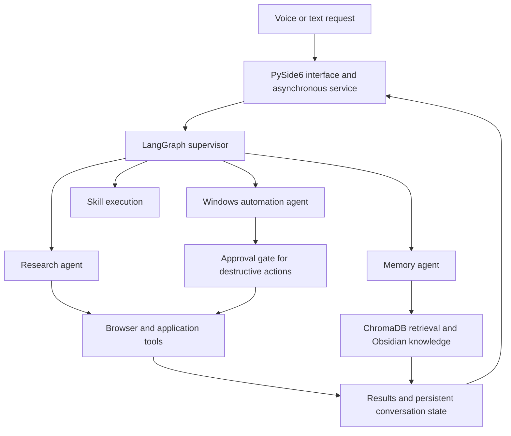
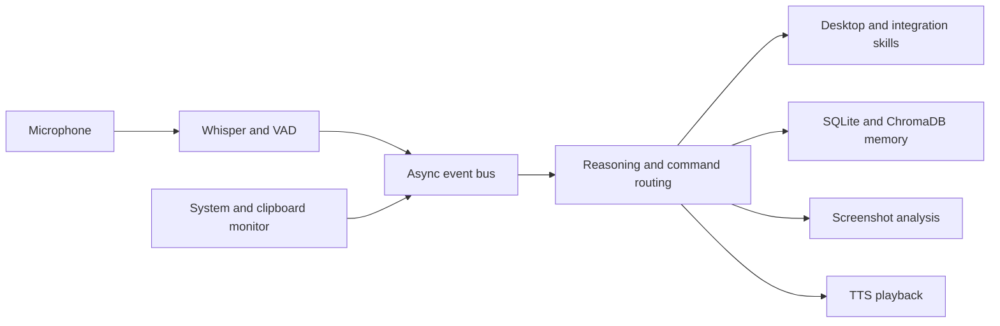

# Quadro

### A personal computer agent: reasoning, memory, perception and action

Quadro is my independent AI engineering project, developed solo since **October 2025**. I started it to learn by building a complete system and to put that system to use in my own work.

The central idea is to turn a request into coordinated work across tools and applications: understand the task, retrieve relevant context, decide which capabilities are needed, execute them and retain useful knowledge.

**Long-term scope:** a general-purpose computer agent capable of carrying out almost any task a person can perform on their computer. That is the direction of the project, with capabilities being developed and verified incrementally.

## Project status

| Version | Architecture | Source availability |
| --- | --- | --- |
| This repository | Earlier asynchronous, event-driven prototype | Public |
| Current development build | LangGraph supervisor and specialist agents, desktop interface and expanded tool execution | Developed locally; source is not included in this repository |

The sections below distinguish the public implementation from the current development work. Some internal classes and filenames retain the earlier name **Jarvis**; the project is now presented as **Quadro**.

## Current development architecture

The current local build extends the original prototype into a stateful agent system:



- **Agent coordination:** a supervisor routes work to specialist agents and carries state across the workflow.
- **Perception and speech:** local transcription and speech synthesis, OCR and screen understanding connect spoken requests to the computer's current context.
- **Memory and context:** semantic retrieval, a local knowledge vault and persistent conversation records support continuity between tasks.
- **Execution controls:** protected skills, destructive-action approval gates, cancellation and timeouts manage tool execution.
- **Desktop integration:** an asynchronous service and PySide6 interface handle queued requests, attachments and progress events.
- **Reliability work:** regression tests accompany development of execution, memory and service behavior.

The current build uses **Python, LangGraph, Gemini, ChromaDB, SQLite, Whisper, Kokoro, EasyOCR, Playwright and PySide6**. These components belong to the current local build, rather than the earlier source snapshot below.

## Public prototype: implemented capabilities

The public code demonstrates the first architecture behind the project:

| Area | Implementation |
| --- | --- |
| Event coordination | An asyncio event bus connects speech input, reasoning, speech output and system monitoring |
| Speech input | Faster Whisper, WebRTC VAD and a microphone stream |
| Reasoning | OpenAI GPT-4o with conversation history and retrieved facts |
| Screen understanding | Screenshot capture and GPT-4o vision |
| Speech output | OpenAI TTS with controlled playback and interruption handling |
| Retrieval memory | SQLite facts, MiniLM embeddings and a persistent ChromaDB index |
| Desktop actions | Windows system controls, application audio, browser searches and project scaffolding |
| Optional integrations | Spotify playback controls and gaming utilities |

This prototype uses explicit command routing for desktop skills. It does not contain the current LangGraph agents or desktop GUI.

### Public architecture



Blocking model calls and skill execution are dispatched through an executor to keep the event loop available.

## Running the public prototype

This is a **Windows-oriented development prototype**. The speech loader currently selects CUDA with float16 and `local_files_only=True`, so it expects a compatible CUDA runtime and a locally cached **large-v3-turbo** Faster Whisper model. The public dependency list also includes optional experimental packages; a clean installation has not been validated across environments.

From the repository root in PowerShell:

```powershell
python -m venv .venv
.\.venv\Scripts\python.exe -m pip install -r requirements.txt
```

Create a local `.env`:

```dotenv
OPENAI_API_KEY=your_key_here
# Optional Spotify configuration
SPOTIFY_CLIENT_ID=your_client_id
SPOTIFY_CLIENT_SECRET=your_client_secret
SPOTIFY_REDIRECT_URI=your_registered_redirect_uri
```

OpenAI provides reasoning, screenshot analysis and TTS in this snapshot. A microphone and audio output device are required. Spotify commands require the corresponding developer configuration and account authorization.

Once the model and runtime prerequisites are available:

```powershell
.\.venv\Scripts\python.exe main.py
```

Use **Ctrl+C** to stop the event loop and audio services.

### Example interactions

- “What's on my screen?”
- “Remember that I am studying AI and data science.”
- “Set Spotify volume to 30.”
- “Switch to work mode.”

The prototype includes direct system commands and clipboard monitoring. Review the enabled skills before running it on a working machine. Conversation context and requested screenshots are sent to OpenAI; retrieved facts are stored locally. The approval controls described for the current build are not implemented in this earlier snapshot.

## Repository map

```text
main.py                 Async application entry point
config/settings.py      Environment configuration and modes
core/
  bus.py                Event bus
  events.py             Event types
  ears.py               Speech input
  brain.py              Reasoning and command routing
  eyes.py               Screenshot analysis
  voice.py              Speech synthesis and playback
  memory.py             SQLite and semantic retrieval
  watchdog.py           System and clipboard monitoring
skills/
  system.py             Windows actions
  browser.py            Search shortcuts
  academic.py           Project scaffolding
  spotify.py            Music integration
  gaming.py             Gaming utilities
requirements.txt
```

## Development direction

The next stages focus on broader task execution, stronger evaluation of multi-step workflows and more reliable context handling across applications. General-purpose computer use remains a development goal; this repository does not claim that Quadro can already perform every possible task.

**Author:** [Amer Alomari](https://github.com/quadrosema) · [LinkedIn](https://www.linkedin.com/in/amer-alomari-/)
